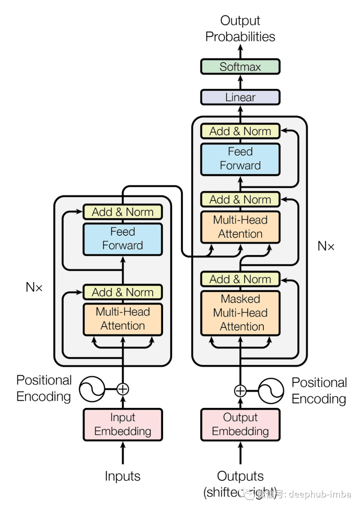

# 文字生成任务
Seq2Seq任务 
输出的文字是不定长，多长也交由模型来确定。 
### Autoregressive 自回归
编码器产生的输入取辅助作用，编码器输入中起主要作用的是其他token。 
START token 表示一句话开始，将其输入解码器产生第一个字，然后将产生的第一个字作为产生第二句话的token输入解码器，以此类推。 
这也是为什么大语言模型总是一个字一个字输出出来的底层原因。

回想前面的transformer架构，

解码器与编码器的主要差异在于**Masked Multi-Head Attention**和多出的**Multi-Head Attention**。 

#### Masked Multi-Head Attention
如果只是简单以前一个输出作输入，则当前一个出错时，会将后面所有的内容污染，难以正确输出。同样，这种方式只能串行，时间上不能接受。 
Masked Multi-Head Attention将原有的自注意力机制中，当前输出所依赖于时序上更靠后的计算消去(Masked)，让模型只能看到以前的，不能看到以后的， 
这就避免了“考试作弊”的情形。

而生成句子的长度问题，可以通过将词表中添加特殊token **END**，这样就可以让模型停止继续生成了。

### 生成任务是如何训练的？
以**START**+LABEL作为输入，以LABEL+**END**作为期望输出，将期望输出与实际输出比较，计算Loss。 

#### 生成任务的推断（测试）与一般任务的测试的不同
一般任务的推断，其训练的方式就是测试的方式，两者本质是同一过程。 
生成任务的推断与训练的方式不同，训练时，标签是直接作为输入的，测试并没有标签作为输入，只能采用整体串行执行的方式。 

#### Beam Search
测试的整体串行是影响模型的输出速度的一部分原因，还有一部分来自于搜索策略上的两难， 
贪心策略更快，每一步只看当前，但是很可能陷入局部最优；全局策略更好，但是时延更大。 
Beam Search 的步长为1，则为贪婪策略，步长越长考虑的范围越广。 

### Cross Attention
Cross Attention的$W^q W^k W^v$，生成任务的自注意力机制只产生$W^q$， 
编码器输出$W^k W^v$，两边一同作为Cross Attention的输入。